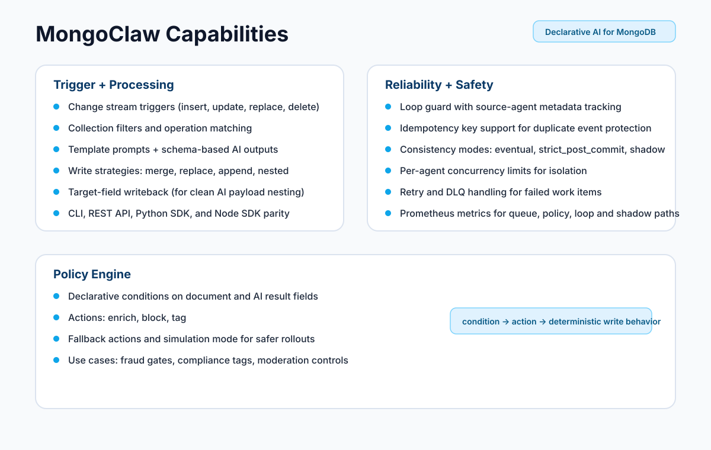
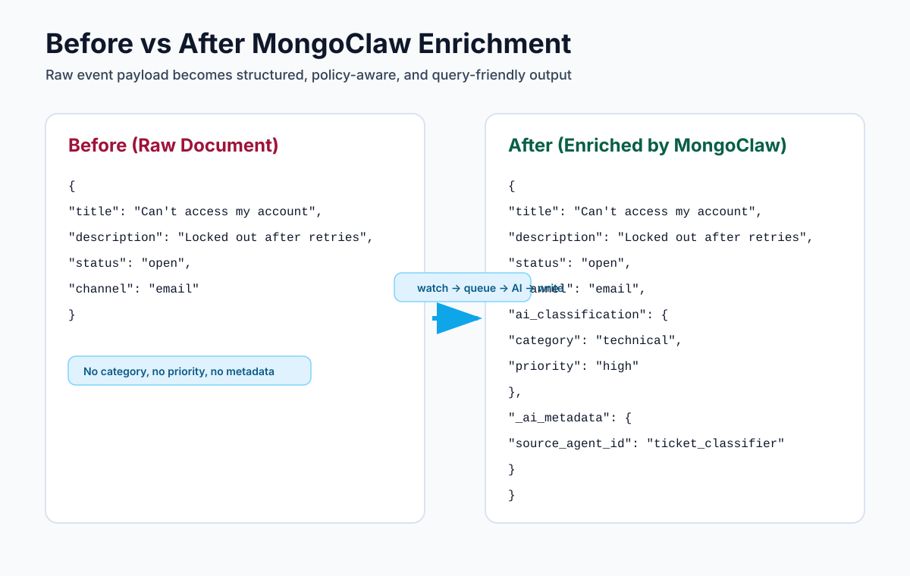

<p align="center">
  
</p>

<h1 align="center">MongoClaw</h1>

<h3 align="center"><em>A Clawbot army for every collection</em></h3>

<p align="center">
  <strong>Event-driven AI mutation runtime for MongoDB</strong><br>
  Automatically enrich documents with AI using change streams
</p>

<p align="center">
  <a href="https://www.python.org/downloads/"></a>
  <a href="https://opensource.org/licenses/MIT"></a>
  <a href="https://github.com/astral-sh/ruff"></a>
</p>

---

## What is MongoClaw?

MongoClaw watches your MongoDB collections for changes. When a document is inserted or updated, it automatically sends it to an AI model for processing (classification, summarization, extraction, etc.) and writes the results back to your database.

**The workflow is simple:**

```
1. You define your MongoClaw agent, or bring your existing external agent, and configure what collection to watch and where to write results
2. MongoClaw watches MongoDB using change streams
3. When a matching document arrives, it queues it for processing
4. Workers execute enrichment using the configured provider (direct model call or external agent endpoint)
5. Response is parsed and written back to the document
```

**Example use cases:**
- Auto-classify support tickets by category and priority
- Generate summaries for articles and blog posts
- Extract entities from customer feedback
- Analyze sentiment in reviews
- Tag and categorize products

---

## Problem

Production teams want AI enrichment in operational databases, but most implementations become fragile quickly:

- Custom change-stream consumers per use case
- Ad hoc retry/error handling and no DLQ discipline
- Inconsistent prompt/version control across teams
- Weak observability for latency, failures, and cost
- Hard migration path when moving from direct LLM calls to external/internal agents

MongoClaw addresses this by turning enrichment into a declarative, managed runtime and control plane.

## Solution

MongoClaw provides a declarative agent model for MongoDB enrichment:

- Watch MongoDB change streams
- Route matching events into resilient queues
- Execute enrichment through direct LLM providers or external agent endpoints
- Parse/validate responses
- Write results back with idempotency and execution audit trails

This gives you one consistent control plane for enrichment workloads across teams.

## Core Features

- Declarative agent configs (YAML/JSON)
- MongoDB change-stream driven processing
- Redis Streams queueing with consumer groups
- Multiple execution providers:
  - Direct LLM providers via LiteLLM
  - External agent provider (`ai.provider=external`)
- Prompt templating (Jinja2) with structured response parsing
- Write strategies (`merge`, `replace`, `append`, `nested`)
- Idempotency and deduplication controls
- Agent-level execution controls (timeouts, retries, priority, concurrency caps)
- CLI, REST API, Python SDK, Node SDK

## Scale & Reliability

- Worker pool with configurable concurrency
- Backpressure-aware dispatch controls
- Fair stream scheduling and starvation metrics
- Retry with exponential backoff
- Dead-letter queue support for unrecoverable work
- Resume-token handling for change-stream continuity
- Throughput benchmarked and observable via metrics endpoints

## Security & Governance

- API key authentication (`X-API-Key`)
- Pluggable secrets backends (env, Vault, AWS)
- Optional PII redaction and audit logging controls
- Policy evaluation layer (`enrich`, `block`, `tag`, simulation mode)
- Execution metadata persisted for traceability

## Cost Governance (Current Support)

MongoClaw already captures cost/usage telemetry, but not every budget-control shape is enforced yet.

| Capability | Status | Notes |
|---|---|---|
| Budget caps (global runtime) | Supported now | `MONGOCLAW_AI__GLOBAL_COST_LIMIT_USD` and `MONGOCLAW_AI__GLOBAL_TOKEN_LIMIT` stop new AI calls when process-level limit is reached |
| Cost-per-agent cap enforcement | Not yet enforced | `execution.cost_limit_usd` exists in agent schema today but is not enforced at runtime yet |
| Cost-per-collection cap enforcement | Not yet enforced | Can be approximated using execution history and metrics labels, but no native hard cap yet |
| Observed spend metrics | Supported now | Prometheus `mongoclaw_ai_cost_usd_total` + execution metadata (`_ai_metadata.cost_usd`) |

This means MongoClaw is already usable for spend observability and global kill-switch limits, with finer-grained budget policy as the next governance layer.

## Policy-As-Code (Current Support)

Current policy configuration is expression-based:

```yaml
policy:
  condition: "document.status == 'restricted'"
  action: block
  fallback_action: enrich
  simulation_mode: false
```

Supported actions today:
- `enrich`
- `block`
- `tag`
- `simulation_mode` (evaluate and report, skip writeback)

## Enterprise Readiness

- Works with existing MongoDB/Redis infrastructure
- Docker/Kubernetes/Helm deployment options
- Prometheus metrics and structured logging
- Versioned agent configs with runtime enable/disable
- Runtime guardrails that can evolve into AI data governance policy layers
- Clear migration path:
  - start with direct model calls
  - move to external/internal agent endpoints without changing watch/write topology

## High-Impact Use Cases

MongoClaw is especially useful where asynchronous enrichment must be reliable and auditable.  
That has direct implications for:

- Fraud systems
- Risk engines
- CRM automation
- Content pipelines
- Marketplace moderation
- Financial compliance systems

## Agent Examples By Domain

Example YAMLs are in `configs/agents/`:

- `configs/agents/fraud_scoring_external.yaml`
- `configs/agents/risk_engine_classifier.yaml`
- `configs/agents/crm_lead_router.yaml`
- `configs/agents/content_enricher.yaml`
- `configs/agents/listing_moderation.yaml`
- `configs/agents/aml_screening.yaml`

---

## Architecture

<p align="center">
  
</p>

---

## Capabilities

MongoClaw is built to run real AI enrichment workflows on MongoDB collections:

- Declarative agents:
  Define agents in YAML/JSON with `watch`, `ai`, `write`, `execution`, and optional `policy` blocks.
- Change stream triggers:
  React to `insert`, `update`, `replace`, and `delete` events with collection-level filters.
- Structured AI output:
  Use response schemas and template-driven prompts for predictable fields.
- Flexible writeback:
  `merge`, `replace`, `append`, `nested`, and `target_field` output patterns.
- Idempotent writes:
  Optional idempotency keys and metadata tracking for duplicate-event safety.
- Loop protection:
  Agent-origin metadata avoids same-agent retrigger cascades.
- Consistency controls:
  `eventual`, `strict_post_commit`, and `shadow` execution modes.
- Policy-driven actions:
  Evaluate conditions and apply `enrich`, `block`, or `tag` actions with fallback behavior.
- Runtime isolation:
  Per-agent concurrency caps to reduce noisy-neighbor impact.
- Observability:
  `/metrics` endpoint with execution, queue, loop guard, shadow mode, policy, and API metrics.
- Interfaces:
  CLI, REST API, Python SDK, and Node SDK support for the same agent model.

<p align="center">
  
</p>

---

## What’s New (Latest Runtime Features)

Recent updates added production-focused execution controls:

- Deterministic strict mode:
  `strict_post_commit` now enforces optimistic version checks and increments `_mongoclaw_version` atomically.
- Optional source hash guard:
  `execution.require_document_hash_match` can block stale writes when document content changed.
- Execution lifecycle persistence:
  Execution records now persist `status`, `lifecycle_state`, `reason`, and `written` for auditability.
- Fair scheduling and stream isolation:
  Rotating stream order, per-stream dequeue caps, and optional in-flight cap per agent stream.
- Dispatch backpressure admission:
  Queue-pressure aware dispatch with priority bypass and overflow policy (`drop`, `defer`, `dlq`).
- Horizontal-scale routing controls:
  Env-driven routing strategy (`by_agent`, `by_collection`, `single`, `partitioned`, `by_priority`) and partition count.
- Failure isolation and SLO metrics:
  Per-agent failure budgets with temporary quarantine and latency SLO violation counters.

---

## Operations UI (Live Dashboard)

MongoClaw now includes a lightweight operations console at `/ui` in this repo for real-time visibility.

It provides:
- Health status from `/health` and `/health/detailed`
- Agent inventory and controls (enable/disable/validate)
- Live execution feed from `/api/v1/executions`
- 24h status distribution from `/api/v1/executions/stats`
- Resilience metrics from `/metrics` (DLQ, retries, loop guard, quarantine, circuit breakers)

Run it locally:

```bash
cd ui
python3 -m http.server 4173
```

Then open `http://127.0.0.1:4173`, set API URL (for example `http://127.0.0.1:8000`) and your `X-API-Key`.

---

## Prerequisites

Before using MongoClaw, you need:

| Requirement | Why |
|-------------|-----|
| **MongoDB 4.0+** | With replica set enabled (required for change streams) |
| **Redis 6.0+** | For job queue and coordination |
| **AI Provider API Key** | OpenAI, Anthropic, OpenRouter, or any LiteLLM-supported provider |
| **Python 3.11+** | Runtime |

---

## Installation

```bash
pip install mongoclaw
```

This installs:
- `mongoclaw` CLI command
- Python SDK (`from mongoclaw.sdk import MongoClawClient`)

---

## Quick Start (5 minutes)

### Step 1: Start Infrastructure

**Option A: Using Docker Compose (recommended)**
```bash
git clone https://github.com/supreeth-ravi/mongoclaw.git
cd mongoclaw
docker-compose up -d
```

**Option B: Manual Setup**
```bash
# Start MongoDB with replica set
docker run -d --name mongo -p 27017:27017 mongo:7 --replSet rs0
docker exec mongo mongosh --eval "rs.initiate()"

# Start Redis
docker run -d --name redis -p 6379:6379 redis:7-alpine
```

**Option C: Use Your Existing MongoDB + Redis**

If you already run MongoDB/Redis, you can skip Docker infra and point MongoClaw to your existing services.

Requirements for existing MongoDB:

- Replica set enabled (required for change streams)
- MongoDB user with read/write permissions on:
  - watched databases/collections
  - MongoClaw metadata collections (`agents`, `executions`, `resume_tokens`, etc.)

Set environment variables:

```bash
# Existing MongoDB (must include replicaSet)
MONGOCLAW_MONGODB__URI=mongodb://<user>:<pass>@<mongo-host>:27017/mongoclaw?replicaSet=<rs-name>

# Existing Redis
MONGOCLAW_REDIS__URL=redis://<redis-host>:6379/0

# API auth keys (comma-separated allowed)
MONGOCLAW_SECURITY__API_KEYS=test-key

# AI defaults (if using direct LLM providers)
MONGOCLAW_AI__DEFAULT_MODEL=openrouter/openai/gpt-4o-mini
OPENROUTER_API_KEY=sk-or-...
```

Then run only MongoClaw:

```bash
mongoclaw test connection
mongoclaw server start
```

### Step 2: Configure Environment

Create a `.env` file:
```bash
# MongoDB (must have replica set for change streams)
MONGOCLAW_MONGODB__URI=mongodb://localhost:27017/mongoclaw?replicaSet=rs0

# Redis
MONGOCLAW_REDIS__URL=redis://localhost:6379/0

# AI Provider (choose one)
OPENAI_API_KEY=sk-...
# or
OPENROUTER_API_KEY=sk-or-...
MONGOCLAW_AI__DEFAULT_MODEL=openrouter/openai/gpt-4o-mini
```

### Step 3: Verify Connections

```bash
mongoclaw test connection
```
```
Testing MongoDB connection...
  ✓ MongoDB connected
Testing Redis connection...
  ✓ Redis connected
```

```bash
mongoclaw test ai --prompt "Say hello"
```
```
  ✓ AI provider connected
  Response: Hello!
```

### Step 4: Create Your First Agent

Create `ticket_classifier.yaml`:
```yaml
id: ticket_classifier
name: Ticket Classifier

# What to watch
watch:
  database: support
  collection: tickets
  operations: [insert]
  filter:
    status: open

# AI configuration
ai:
  model: gpt-4o-mini  # or openrouter/openai/gpt-4o-mini
  prompt: |
    Classify this support ticket:

    Title: {{ document.title }}
    Description: {{ document.description }}

    Respond with JSON:
    - category: billing, technical, sales, or general
    - priority: low, medium, high, or urgent
  response_schema:
    type: object
    properties:
      category:
        type: string
        enum: [billing, technical, sales, general]
      priority:
        type: string
        enum: [low, medium, high, urgent]

# Where to write results
write:
  strategy: merge
  target_field: ai_classification

enabled: true
```

If you already have an external agent service, create an external-agent config instead:

```yaml
id: ticket_classifier_external
name: Ticket Classifier (External Agent)

watch:
  database: support
  collection: tickets
  operations: [insert]
  filter:
    status: open

ai:
  provider: external
  model: customer_enrichment_agent
  prompt: |
    Enrich this support ticket:
    {{ document | tojson }}
  response_schema:
    type: object
    properties:
      category: { type: string }
      priority: { type: string }
      summary: { type: string }
  extra_params:
    external_url: https://agents.example.com/run
    external_auth_token: YOUR_TOKEN
    external_auth_header: Authorization
    external_agent_id: customer_enrichment_agent
    external_timeout_seconds: 60

write:
  strategy: merge
  target_field: ai_classification

enabled: true
```

### Step 5: Register the Agent

```bash
mongoclaw agents create -f ticket_classifier.yaml
```
```
✓ Created agent: ticket_classifier
```

### Step 6: Start MongoClaw Server

```bash
mongoclaw server start
```

MongoClaw is now watching for new tickets!

### Step 7: Test It

Insert a document into MongoDB:
```javascript
// Using mongosh or your app
db.tickets.insertOne({
  title: "Can't access my account",
  description: "I've been locked out after too many password attempts",
  status: "open"
})
```

Within seconds, the document will be enriched:
```javascript
db.tickets.findOne({ title: "Can't access my account" })
```
```json
{
  "_id": "...",
  "title": "Can't access my account",
  "description": "I've been locked out after too many password attempts",
  "status": "open",
  "ai_classification": {
    "category": "technical",
    "priority": "high"
  }
}
```

<p align="center">
  
</p>

---

## How to Use MongoClaw

There are 4 ways to interact with MongoClaw:

### Important Runtime Model


Process:

1. Start infra (MongoDB + Redis)
2. Start MongoClaw server (`mongoclaw server start`)
3. Run client code (CLI, Python SDK, or Node SDK) with:
   - `base_url` -> where server is running
   - `api_key` -> your configured API key

Example local values:

- `base_url`: `http://127.0.0.1:8000`
- `api_key`: any key configured via `MONGOCLAW_SECURITY__API_KEYS` (example: `test-key`)

### 1. CLI (Command Line)

Best for: Setup, testing, admin tasks

```bash
# Manage agents
mongoclaw agents list
mongoclaw agents create -f agent.yaml
mongoclaw agents get <agent_id>
mongoclaw agents enable <agent_id>
mongoclaw agents disable <agent_id>
mongoclaw agents delete <agent_id>

# Test before deploying
mongoclaw test agent <agent_id> -d '{"title": "Test"}'

# Server management
mongoclaw server start
mongoclaw server status

# Health checks
mongoclaw health
mongoclaw test connection
mongoclaw test ai
```

### 2. REST API

Best for: Web apps, integrations, programmatic access

Start the server:
```bash
mongoclaw server start --api-only
```

API is available at `http://localhost:8000`:

| Method | Endpoint | Description |
|--------|----------|-------------|
| GET | `/health` | Health check |
| GET | `/docs` | Swagger UI (interactive docs) |
| GET | `/api/v1/agents` | List all agents |
| POST | `/api/v1/agents` | Create agent |
| GET | `/api/v1/agents/{id}` | Get agent details |
| PUT | `/api/v1/agents/{id}` | Update agent |
| DELETE | `/api/v1/agents/{id}` | Delete agent |
| POST | `/api/v1/agents/{id}/enable` | Enable agent |
| POST | `/api/v1/agents/{id}/disable` | Disable agent |
| GET | `/api/v1/executions` | List execution history |
| GET | `/metrics` | Prometheus metrics |

Execution records include `status`, `lifecycle_state`, `reason`, and `written` so you can distinguish successful writes vs deterministic skips/conflicts.

**Example:**
```bash
# List agents
curl http://localhost:8000/api/v1/agents

# Create agent
curl -X POST http://localhost:8000/api/v1/agents \
  -H "Content-Type: application/json" \
  -d @agent.json
```

### 3. Python SDK

Best for: Python applications, scripts, automation

```python
from mongoclaw.sdk import MongoClawClient

# Initialize client
client = MongoClawClient(
    base_url="http://localhost:8000",
    api_key="test-key",  # required when API keys are enabled
)

# List agents
agents = client.list_agents()
for agent in agents:
    print(f"{agent.id}: {agent.name}")

# Create agent
client.create_agent({
    "id": "my_agent",
    "name": "My Agent",
    "watch": {"database": "mydb", "collection": "docs"},
    "ai": {"model": "gpt-4o-mini", "prompt": "..."},
    "write": {"strategy": "merge", "target_field": "ai_result"}
})

# Enable/disable
client.enable_agent("my_agent")
client.disable_agent("my_agent")

# Check health
if client.is_healthy():
    print("MongoClaw is running!")
```

The script above **calls** an already-running MongoClaw server.  
It does not start MongoClaw server by itself.

**Async version:**
```python
from mongoclaw.sdk import AsyncMongoClawClient

async with AsyncMongoClawClient(base_url="http://localhost:8000") as client:
    agents = await client.list_agents()
```

**Python SDK capability map:**

- Health: `health`, `health_detailed`, `is_healthy`
- Agent lifecycle: `list_agents`, `get_agent`, `create_agent`, `update_agent`, `enable_agent`, `disable_agent`, `delete_agent`, `validate_agent`
- Execution visibility: `list_executions`, `get_execution`, `wait_for_execution`
- Metrics access: `get_metrics`
- Optional/route-dependent methods: `retry_execution`, `trigger_agent`, `get_agent_stats`
  (available only if corresponding API routes are enabled in your server build)

### 4. Node.js SDK

Best for: Node.js/TypeScript applications

```typescript
import { MongoClawClient } from 'mongoclaw';

const client = new MongoClawClient({ baseUrl: 'http://localhost:8000' });

// List agents
const { agents } = await client.listAgents();

// Create agent
await client.createAgent({
  id: 'my_agent',
  name: 'My Agent',
  watch: { database: 'mydb', collection: 'docs' },
  ai: { model: 'gpt-4o-mini', prompt: '...' },
  write: { strategy: 'merge', target_field: 'ai_result' }
});
```

Like Python SDK, Node SDK is an HTTP client and does not start server/runtime.

---

## SDK Testing Playbook (Developer)

This section is the recommended way to showcase and validate MongoClaw SDK behavior before release.

### 1. Test environment requirements

- MongoDB with replica set enabled
- Redis reachable from runtime
- MongoClaw runtime running (`mongoclaw server start`)
- API reachable (`/health`, `/health/detailed`)
- API key configured if auth is enabled (`X-API-Key`)
- AI provider key configured and tested (`mongoclaw test ai`)

### 2. Minimum release gate (must pass)

1. SDK health checks and auth flow
2. Agent CRUD lifecycle (create/list/get/update/enable/disable/delete)
3. End-to-end enrichment from MongoDB insert -> AI -> MongoDB writeback
4. Execution audit visibility from SDK (`list_executions`)
5. Retry behavior on transient failures
6. Throughput baseline with fixed prompt/model profile

### 3. Advanced scenario matrix (recommended)

| Scenario | Why it matters | Expected result |
|---|---|---|
| Insert + rapid updates on same doc before enrichment | Detect stale writeback risk | In `eventual`, stale output may appear |
| `deduplicate=true` vs `false` under rapid updates | Validate idempotency window behavior | Fewer duplicate effective writes when enabled |
| `strict_post_commit` on same race workload | Prevent stale final writes | Stale writes suppressed (`strict_version_conflict` / `hash_conflict`) |
| Same-doc stress with `max_concurrency=1` vs higher | Understand ordering/concurrency effects | Compare stale rate + execution volume |
| Idempotency replay (duplicate payload/event) | Validate duplicate protection | Duplicate execution should be skipped from writeback |
| Failure + retry + recovery | Validate resilience | Initial failures, then successful completion after fix |
| DLQ path (`max_retries=0` or repeated failures) | Validate dead-letter safety net | Failed item reaches DLQ and can be retried manually |
| Policy: `block`, `tag`, `simulation_mode` | Validate guardrail behavior | Write blocked/tagged/simulated per policy |
| Burst load + backpressure metrics | Validate admission control observability | Dispatch/admission metrics reflect pressure decisions |
| Mixed-priority load | Validate priority bypass behavior | High-priority items admitted first when pressure is active |
| Multi-agent same collection, different target fields | Validate composition | Both fields enriched without overwrite |
| Multi-agent same target field | Validate conflict semantics | Last-writer-wins unless field partitioning is used |
| Agent disable/enable during traffic | Validate operational controls | Disabled: no writes; Enabled: writes resume |
| Webhook-triggered vs change-stream-triggered execution | Validate trigger parity | Same output schema + lifecycle expectations |
| Benchmarks at 100/500/1000 docs | Capacity planning | Track completion ratio and docs/sec at fixed window |

### 4. Baseline SDK e2e script pattern

For every scenario script, capture these fields in output:

- `scenario`, `run_id`, `agent_id`
- `inserted`, `enriched`, `failed`, `skipped`
- `execution_count`, `status_counts`, `reason_counts`
- `elapsed_s`, `throughput_docs_per_s`
- For race tests: `final_seq`, `ai_seen_seq`, `stale_final_ai`
- For DLQ tests: `dlq_before`, `dlq_after`, `dlq_delta`, `recovery_result`

### 5. Reporting format (recommended for PRs/releases)

- Summary table: pass/fail/skip by scenario
- Raw metrics snapshot: throughput, completion ratio, error reasons
- Notes on unsupported routes in the active deployment profile
- Config used for run: model, prompt size, worker pool size, retry settings

---

## Agent Configuration Reference

```yaml
# Unique identifier
id: my_agent
name: My Agent
description: Optional description

# What MongoDB changes to watch
watch:
  database: mydb              # Database name
  collection: mycollection    # Collection name
  operations: [insert, update] # insert, update, replace, delete
  filter:                     # Optional MongoDB filter
    status: active

# AI configuration
ai:
  provider: openai            # openai, anthropic, openrouter, external, etc.
  model: gpt-4o-mini          # Model identifier
  prompt: |                   # Jinja2 template
    Process this document:
    {{ document | tojson }}
  system_prompt: |            # Optional system prompt
    You are a helpful assistant.
  temperature: 0.7            # 0.0 - 2.0
  max_tokens: 1000
  response_schema:            # Optional JSON schema for validation
    type: object
    properties:
      result:
        type: string
  extra_params:               # Optional provider-specific params
    # For provider=external:
    # external_url: https://agents.example.com/run
    # external_auth_token: YOUR_TOKEN
    # external_auth_header: Authorization
    # external_agent_id: customer_enrichment_agent
    # external_timeout_seconds: 60

# How to write results back
write:
  strategy: merge             # merge, replace, or append
  target_field: ai_result     # Where to write (for merge)
  idempotency_key: |          # Prevent duplicate processing
    {{ document._id }}_v1

# Execution settings
execution:
  priority: 5
  max_retries: 3
  retry_delay_seconds: 1.0
  retry_max_delay_seconds: 60
  timeout_seconds: 60
  consistency_mode: eventual # eventual, strict_post_commit, shadow
  require_document_hash_match: false
  max_concurrency: 1         # Optional per-agent in-process concurrency cap
  rate_limit_requests: 100    # Per minute
  cost_limit_usd: 10.0        # Planned per-agent limit (field exists; runtime enforcement not enabled yet)

# Optional declarative policy guardrail
policy:
  condition: result.risk_score > 0.8
  action: block               # enrich, block, tag
  fallback_action: enrich     # skip, enrich
  simulation_mode: false
  tag_field: policy_tag       # used when action=tag
  tag_value: matched

# Enable/disable
enabled: true
```

### External Agent Provider (No Direct LLM Call)

If you already have an external agent service for enrichment, use:

```yaml
ai:
  provider: external
  model: customer_enrichment_agent
  prompt: |
    Enrich this document:
    {{ document | tojson }}
  extra_params:
    external_url: https://agents.example.com/run
    external_auth_token: YOUR_TOKEN
    external_auth_header: Authorization
    external_agent_id: customer_enrichment_agent
    external_timeout_seconds: 60
```

The external endpoint should return one of:

- `content` (string), or
- `output` (string), or
- OpenAI-style `choices[0].message.content`

---

## Deployment

### Docker Compose (Development)

```bash
docker-compose up -d
```

### Kubernetes

```bash
kubectl apply -k deploy/kubernetes/
```

### Helm

```bash
helm install mongoclaw deploy/helm/mongoclaw \
  --set secrets.mongodb.uri="mongodb://..." \
  --set secrets.ai.openaiApiKey="sk-..."
```

---

## Configuration Reference

All settings via environment variables:

```bash
# Core
MONGOCLAW_ENVIRONMENT=development|staging|production

# MongoDB
MONGOCLAW_MONGODB__URI=mongodb://localhost:27017/mongoclaw?replicaSet=rs0
MONGOCLAW_MONGODB__DATABASE=mongoclaw

# Redis
MONGOCLAW_REDIS__URL=redis://localhost:6379/0

# AI
MONGOCLAW_AI__DEFAULT_PROVIDER=openai
MONGOCLAW_AI__DEFAULT_MODEL=gpt-4o-mini
OPENAI_API_KEY=sk-...
ANTHROPIC_API_KEY=sk-ant-...
OPENROUTER_API_KEY=sk-or-...

# API Server
MONGOCLAW_API__HOST=0.0.0.0
MONGOCLAW_API__PORT=8000

# Workers
MONGOCLAW_WORKER__POOL_SIZE=10
MONGOCLAW_WORKER__ROUTING_STRATEGY=by_agent
MONGOCLAW_WORKER__ROUTING_PARTITION_COUNT=8
MONGOCLAW_WORKER__FAIR_SCHEDULING_ENABLED=true
MONGOCLAW_WORKER__FAIR_STREAM_BATCH_SIZE=1
MONGOCLAW_WORKER__FAIR_STREAMS_PER_CYCLE=10
MONGOCLAW_WORKER__MAX_IN_FLIGHT_PER_AGENT_STREAM=50
MONGOCLAW_WORKER__PENDING_METRICS_INTERVAL_SECONDS=10
MONGOCLAW_WORKER__STARVATION_CYCLE_THRESHOLD=20
MONGOCLAW_WORKER__DISPATCH_BACKPRESSURE_ENABLED=true
MONGOCLAW_WORKER__DISPATCH_BACKPRESSURE_THRESHOLD=0.8
MONGOCLAW_WORKER__DISPATCH_OVERFLOW_POLICY=defer # drop|defer|dlq
MONGOCLAW_WORKER__DISPATCH_MIN_PRIORITY_WHEN_BACKPRESSURED=5
MONGOCLAW_WORKER__DISPATCH_DEFER_SECONDS=0.25
MONGOCLAW_WORKER__DISPATCH_DEFER_MAX_ATTEMPTS=3
MONGOCLAW_WORKER__DISPATCH_PRESSURE_CACHE_TTL_SECONDS=1
MONGOCLAW_WORKER__AGENT_ERROR_BUDGET_WINDOW_SECONDS=60
MONGOCLAW_WORKER__AGENT_ERROR_BUDGET_MAX_FAILURES=20
MONGOCLAW_WORKER__AGENT_QUARANTINE_SECONDS=30
MONGOCLAW_WORKER__LATENCY_SLO_MS=3000

# Observability
MONGOCLAW_OBSERVABILITY__LOG_LEVEL=INFO
MONGOCLAW_OBSERVABILITY__LOG_FORMAT=json|console
MONGOCLAW_OBSERVABILITY__METRICS_ENABLED=true
```

---

## Production Presets

Use these as starting profiles, then tune with your own latency/cost/error SLOs.

### Preset A: High Throughput Enrichment (Recommended Default)

Best for: support tickets, catalog tagging, content enrichment where maximum coverage matters more than strict write ordering.

Agent execution:
```yaml
execution:
  consistency_mode: eventual
  timeout_seconds: 12
  max_retries: 2
  retry_delay_seconds: 1
  retry_max_delay_seconds: 8
  max_concurrency: 8
  require_document_hash_match: false
```

Worker/runtime:
```bash
MONGOCLAW_WORKER__POOL_SIZE=16
MONGOCLAW_WORKER__FAIR_SCHEDULING_ENABLED=true
MONGOCLAW_WORKER__MAX_IN_FLIGHT_PER_AGENT_STREAM=100
MONGOCLAW_WORKER__DISPATCH_BACKPRESSURE_ENABLED=true
MONGOCLAW_WORKER__DISPATCH_OVERFLOW_POLICY=defer
MONGOCLAW_WORKER__LATENCY_SLO_MS=3000
```

### Preset B: Strict Correctness / Compliance

Best for: financial/compliance-adjacent flows where stale writes must be blocked.

Agent execution:
```yaml
execution:
  consistency_mode: strict_post_commit
  require_document_hash_match: true
  timeout_seconds: 20
  max_retries: 1
  retry_delay_seconds: 2
  retry_max_delay_seconds: 8
  max_concurrency: 2
```

Worker/runtime:
```bash
MONGOCLAW_WORKER__POOL_SIZE=8
MONGOCLAW_WORKER__DISPATCH_BACKPRESSURE_ENABLED=true
MONGOCLAW_WORKER__DISPATCH_MIN_PRIORITY_WHEN_BACKPRESSURED=7
MONGOCLAW_WORKER__DISPATCH_OVERFLOW_POLICY=defer
MONGOCLAW_WORKER__AGENT_ERROR_BUDGET_MAX_FAILURES=10
MONGOCLAW_WORKER__AGENT_QUARANTINE_SECONDS=60
MONGOCLAW_WORKER__LATENCY_SLO_MS=4000
```

### Preset C: Shadow Rollout / Safe Introduction

Best for: validating new prompts/models before enabling writeback.

Agent execution:
```yaml
execution:
  consistency_mode: shadow
  timeout_seconds: 10
  max_retries: 1
```

Recommended process:
1. Run in `shadow` and inspect `executions` (`status`, `lifecycle_state`, `reason`).
2. Fix prompt/schema issues and reduce `pipeline_error` rate.
3. Promote to `eventual` or `strict_post_commit` based on business correctness requirements.

---

## Testing

### Unit + Integration Tests

Install dev dependencies (includes `pytest`):

```bash
uv sync --extra dev
```

Run test suite:

```bash
uv run pytest -q
```

---

## Project Structure

```
mongoclaw/
├── src/mongoclaw/
│   ├── core/           # Config, types, runtime
│   ├── watcher/        # MongoDB change stream handling
│   ├── dispatcher/     # Queue dispatch logic
│   ├── queue/          # Redis Streams implementation
│   ├── worker/         # AI processing workers
│   ├── ai/             # LiteLLM, prompts, response parsing
│   ├── result/         # Idempotent write strategies
│   ├── agents/         # Agent models, storage, validation
│   ├── security/       # Auth, RBAC, PII redaction
│   ├── resilience/     # Circuit breakers, retry logic
│   ├── observability/  # Metrics, tracing, logging
│   ├── api/            # FastAPI REST API
│   ├── cli/            # Click CLI
│   └── sdk/            # Python SDK
├── sdk-nodejs/         # TypeScript SDK
├── configs/agents/     # Example agent configurations
├── deploy/             # Kubernetes & Helm charts
└── tests/
```

---

## Contributing

Contributions are welcome! Please feel free to submit a Pull Request.

## Planned

- Per-agent runtime budget enforcement for `execution.cost_limit_usd` and token limits
- Per-collection budget caps for shared workloads
- Structured policy DSL (`policy.when`) with field/operator/value rules
- Richer spend rollups in API (agent, collection, and time-window views)

## Author

**Supreeth Ravi**
- Email: supreeth.ravi@phronetic.ai
- GitHub: [@supreeth-ravi](https://github.com/supreeth-ravi)
- Web: [supreethravi.com](https://supreethravi.com)

## License

This project is licensed under the MIT License - see the [LICENSE](LICENSE) file for details.

---

<p align="center">
  Made with ❤️ for the MongoDB + AI community
</p>
